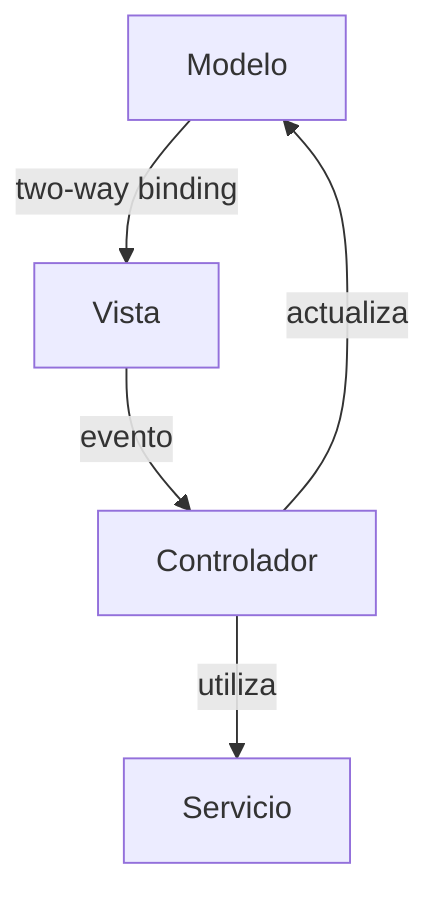

# Arquitectura de AngularJS

AngularJS se apoya en una arquitectura Modelo-Vista-Controlador (MVC) muy flexible. Las piezas fundamentales son:

- **Módulos**: agrupan la funcionalidad y declaran dependencias.
- **Controladores**: enlazan datos del modelo con la vista.
- **Scopes**: actúan como contexto y puente entre vista y lógica.
- **Servicios**: encapsulan lógica reutilizable y acceso a datos.
- **Directivas / Componentes**: extienden HTML para construir UI reutilizable.

Comprender cómo interactúan es la clave para dominar el framework.

## Componentes clave

- **Scopes**: objetos jerárquicos que propagan datos y eventos a través de la vista.
- **Digest cycle**: bucle que detecta cambios evaluando *watchers*. El rendimiento depende de mantener pocos *watchers* y evitar operaciones pesadas dentro de `ng-repeat`.
- **Directivas**: encapsulan lógica de UI. Directivas estructurales como `ng-if` o `ng-repeat` alteran el árbol DOM; directivas de atributo agregan comportamiento reutilizable.
- **Servicios y factories**: singletons compartidos mediante inyección de dependencias, ideales para lógica de negocio y comunicación con APIs.
- **Filtros**: formatean datos en la vista, equivalentes a los pipes de Angular moderno.

## Flujo de datos

El enlace bidireccional simplifica formularios, pero dificulta escalar cuando la lógica de presentación crece. Usa `one-time bindings` (`::propiedad`) para renderizados estáticos.

## Buenas prácticas

1. **Modulariza**: usa `angular.module('app', [...])` para separar dominios.
2. **Evita lógica pesada en controladores**: delega en servicios.
3. **Optimiza watchers**: utiliza `track by` en `ng-repeat` y divide vistas complejas en componentes.
4. **Prueba directivas**: escribe specs con `ngMock` para garantizar su comportamiento.
5. **Prepara la migración**: adopta `component()` y TypeScript cuando sea posible para acercarte a Angular moderno.

## ¿Qué sigue?

En los siguientes documentos profundizamos en cada pieza:

- **Primeros pasos**: cómo arrancar tu proyecto desde cero.
- **Módulos y bootstrapping**: ciclo de arranque, `config()`, `run()` y DI.
- **Directivas y componentes**: creación y patrones avanzados.
- **Filtros y pipes**: formateo y reutilización.
- **Routing, formularios, testing y despliegue**: guía completa para llevar la aplicación a producción.

