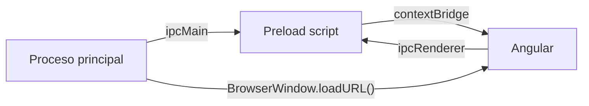

# ¿Por qué Electron?

Electron permite empaquetar aplicaciones web (Angular, React, Vue…) como aplicaciones de escritorio multiplataforma (Windows, macOS, Linux). Combina **Chromium** como motor de renderizado y **Node.js** como runtime, ofreciendo acceso a APIs nativas (sistema de archivos, notificaciones, procesos, etc.).

## Casos de uso típicos

- Back-offices corporativos que requieren acceso a recursos locales o entornos air-gapped.
- Herramientas internas que necesitan distribución rápida sin pasar por navegadores controlados.
- Aplicaciones híbridas que consumen la misma API que la versión web pero con funcionalidades extra (impresión, dispositivos externos).

## Arquitectura básica

| Proceso | Descripción | Tecnologías |
| --- | --- | --- |
| **Proceso principal** | Controla la ventana, menú, ciclo de vida de Electron. | Node.js, `BrowserWindow`, `ipcMain` |
| **Proceso de renderizado** | Ejecuta la aplicación Angular (o cualquier front web). | Chromium, Angular, `ipcRenderer` |
| **Preload scripts** | Capa intermedia que expone APIs seguras al renderizado. | Node.js (context bridge) |

## Requisitos

- Node.js ≥ 20.
- `npm` o `pnpm`.
- Conocimientos básicos de TypeScript y Angular (para la capa de UI).

## Flujo de trabajo general

1. Generar la app Angular (`ng new` o `nx g @nrwl/angular:app`).
2. Añadir Electron como runtime (`npm install electron electron-builder`).
3. Configurar scripts (`main.ts`, `preload.ts`, `package.json`).
4. Integrar la build de Angular en el `BrowserWindow`.
5. Empaquetar con electron-builder o Forge.

Las siguientes guías muestran cómo unir Angular con Electron y cómo distribuir la aplicación en diferentes plataformas.

