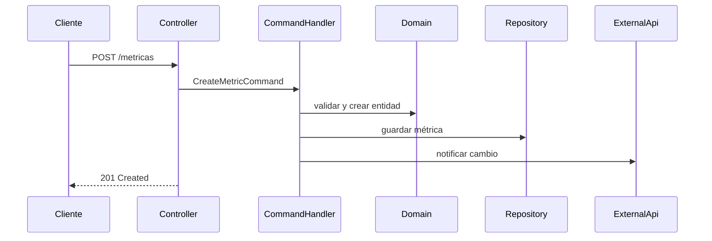

# Arquitectura basada en puertos y adaptadores

Para la mayoría de mis servicios Spring Boot adopto una arquitectura hexagonal. Esto mantiene el dominio independiente de la infraestructura y facilita las pruebas unitarias.

## Organización de paquetes

```
src/main/java/com/antoniosaborido/aplicacion/
├── application
│   ├── commandhandlers
│   ├── queryhandlers
│   └── services
├── domain
│   ├── model
│   ├── repositories
│   └── events
├── infrastructure
│   ├── configuration
│   ├── persistence
│   ├── rest
│   └── scheduling
├── support
│   ├── mapper
│   ├── eventbus
│   └── security
└── shared
    └── exceptions
```

### Capa de dominio

- Entidades y *value objects* inmutables.
- Repositorios definidos como interfaces.
- Eventos de dominio para desacoplar reacciones.
- Asegura reglas de negocio explícitas: invariantes en constructores/fábricas (`AggregateRoot`).
- Usa `DomainEvents` para notificar acciones críticas y permitir integraciones event-driven.

### Capa de aplicación

- **Command Handlers** para operaciones que cambian estado.
- **Query Handlers** para lecturas optimizadas.
- Servicios orquestadores que coordinan repositorios y adaptadores.
- Implementa `UseCases` idempotentes y transacciones declarativas (`@Transactional`).

### Capa de infraestructura

- Adaptadores de entrada: controladores REST, jobs, listeners.
- Adaptadores de salida: implementaciones de repositorios con Spring Data, clientes HTTP, colas.
- Configuración transversal (seguridad, observabilidad, mapeadores).
- Include `Outbox` pattern para eventos consistentes, `RetryTemplate` para resiliencia y `MessagePublisher` para colas.

## Patrones recomendados

- **DTO ↔ Mapper ↔ Domain**: uso MapStruct o conversiones manuales según complejidad.
- **Servicios idempotentes**: especialmente en jobs y endpoints críticos.
- **Validación exhaustiva**: `javax.validation` a nivel DTO y comprobaciones adicionales en el dominio.
- **Module boundaries**: usa `module-info.java` o convenciones Maven/Gradle multi-módulo para separar dominios.
- **Observabilidad**: expone métricas por módulo (Actuator `meterRegistry`) y logging estructurado con `logstash-logback-encoder`.

## Ejemplo de flujo



## Beneficios obtenidos

- Test unitarios aislados del framework.
- Facilidad para sustituir infraestructura (Oracle ↔ PostgreSQL) sin cambiar el dominio.
- Separación clara de responsabilidades que acelera el onboarding de nuevos desarrolladores.
- Posibilidad de migrar a microservicios: cada módulo puede exponerse como bounded context.
- Mejora de observabilidad y auditoría (eventos de dominio → logging estructurado → dashboards Grafana).

