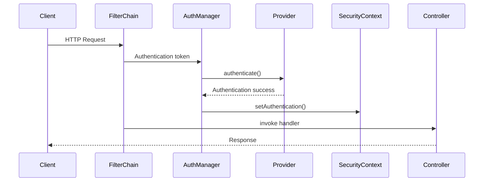

# Spring Security de principio a fin

Spring Security protege aplicaciones Java desde formularios tradicionales hasta APIs distribuidas con OAuth2. Esta guía resume la arquitectura, los flujos más habituales y ejemplos prácticos tanto en Spring Framework clásico como en Spring Boot.

---

## 1. Arquitectura y flujo

1. **SecurityFilterChain** intercepta cada petición HTTP.
2. Los filtros de autenticación extraen credenciales (form login, JWT, OAuth2).
3. `AuthenticationManager` delega en uno o varios `AuthenticationProvider`.
4. Si la autenticación es válida se almacena en `SecurityContext`.
5. Los filtros de autorización verifican permisos antes de llegar al controlador.



---

## 2. Configuración base (Spring Boot)

```java
@Configuration
public class SecurityConfig {

  @Bean
  public SecurityFilterChain securityFilterChain(HttpSecurity http) throws Exception {
    http
      .authorizeHttpRequests(auth -> auth
        .requestMatchers("/", "/assets/**", "/login").permitAll()
        .requestMatchers("/admin/**").hasRole("ADMIN")
        .anyRequest().authenticated())
      .formLogin(login -> login
        .loginPage("/login")
        .defaultSuccessUrl("/dashboard", true))
      .logout(logout -> logout.logoutSuccessUrl("/login?logout"))
      .rememberMe(Customizer.withDefaults())
      .csrf(Customizer.withDefaults());
    return http.build();
  }

  @Bean
  public PasswordEncoder passwordEncoder() {
    return PasswordEncoderFactories.createDelegatingPasswordEncoder();
  }
}
```

- Con Spring Framework clásico registra `DelegatingFilterProxy` en `web.xml` o `WebApplicationInitializer`.

---

## 3. Autenticación personalizada

### `UserDetailsService` + base de datos

```java
@Service
public class JpaUserDetailsService implements UserDetailsService {
  private final UsuarioRepository repository;

  @Override
  public UserDetails loadUserByUsername(String username) {
    return repository
      .findByUsername(username)
      .map(user -> User
        .withUsername(user.username())
        .password(user.passwordHash())
        .authorities(user.authorities())
        .build())
      .orElseThrow(() -> new UsernameNotFoundException("Usuario no encontrado"));
  }
}
```

### Autenticación por token (REST/JWT)

```java
@Component
public class JwtAuthFilter extends OncePerRequestFilter {
  private final JwtService jwtService;

  @Override
  protected void doFilterInternal(HttpServletRequest request, HttpServletResponse response, FilterChain chain)
      throws ServletException, IOException {
    String token = jwtService.resolveToken(request);
    if (token != null && jwtService.validate(token)) {
      Authentication auth = jwtService.buildAuthentication(token);
      SecurityContextHolder.getContext().setAuthentication(auth);
    }
    chain.doFilter(request, response);
  }
}
```

```java
@Bean
SecurityFilterChain apiFilterChain(HttpSecurity http, JwtAuthFilter jwtFilter) throws Exception {
  return http.securityMatcher("/api/**")
    .csrf(AbstractHttpConfigurer::disable)
    .sessionManagement(sm -> sm.sessionCreationPolicy(SessionCreationPolicy.STATELESS))
    .addFilterBefore(jwtFilter, UsernamePasswordAuthenticationFilter.class)
    .authorizeHttpRequests(auth -> auth
      .requestMatchers("/api/public/**").permitAll()
      .anyRequest().authenticated())
    .build();
}
```

---

## 4. Autorización declarativa

- Habilita `@EnableMethodSecurity`.
- Usa `@PreAuthorize`, `@PostAuthorize`, `@PreFilter`, `@PostFilter`.

```java
@Service
public class PagosService {

  @PreAuthorize("hasAuthority('PAGOS_APROBAR')")
  public void aprobarPago(UUID id) {}

  @PreAuthorize("@tenantSecurity.check(authentication, #tenantId)")
  public void cancelarPago(UUID tenantId, UUID pagoId) {}
}
```

Define un evaluador personalizado:

```java
@Component("tenantSecurity")
public class TenantSecurity {
  public boolean check(Authentication auth, UUID tenantId) {
    return ((CustomPrincipal) auth.getPrincipal()).tenantId().equals(tenantId);
  }
}
```

---

## 5. OAuth2 / OpenID Connect

### Login como cliente (front-channel)

```yaml
spring:
  security:
    oauth2:
      client:
        registration:
          google:
            client-id: ${GOOGLE_CLIENT_ID}
            client-secret: ${GOOGLE_CLIENT_SECRET}
            scope: openid,profile,email
        provider:
          google:
            issuer-uri: https://accounts.google.com
```

```java
@Bean
SecurityFilterChain oauth2Login(HttpSecurity http) throws Exception {
  http
    .authorizeHttpRequests(auth -> auth.anyRequest().authenticated())
    .oauth2Login(Customizer.withDefaults());
  return http.build();
}
```

### Resource Server (APIs protegidas con JWT)

```yaml
spring:
  security:
    oauth2:
      resourceserver:
        jwt:
          issuer-uri: https://idp.antoniosaborido.es/realms/portal
```

```java
@Bean
SecurityFilterChain resourceServer(HttpSecurity http) throws Exception {
  return http
    .authorizeHttpRequests(auth -> auth
      .anyRequest().hasAuthority("SCOPE_api.read"))
    .oauth2ResourceServer(oauth2 -> oauth2.jwt(Customizer.withDefaults()))
    .build();
}
```

---

## 6. Tokens y gestión de credenciales

### 6.1 Tipos de token

- **Access token**: credencial de corta duración (minutos) que autoriza acceder a recursos protegidos. Habitualmente es un JWT firmado.
- **Refresh token**: credencial de larga duración (horas/días) para obtener nuevos access tokens sin pedir contraseñas de nuevo. Solo debe enviarse al Authorization Server.
- **ID token**: token emitido por OpenID Connect que describe la identidad del usuario (perfil, email). No se usa para autorizar APIs, solo para autenticación.
- **Introspection token**: identificador opaco que requiere consulta al servidor para validar (formato no JWT).

### 6.2 Estructura de un JWT

```text
header.payload.signature
```

- **Header**: algoritmo (`alg`) y tipo (`typ`).
- **Payload (claims)**: datos del usuario y metadatos (expiración, audiencias).
- **Signature**: asegura integridad (`base64UrlEncode(header) + '.' + base64UrlEncode(payload)` firmado con la clave).

Ejemplo de payload:

```json
{
  "sub": "9ce634ac-71d7-4ad7-9e87-82d8c4b896f6",
  "iss": "https://idp.antoniosaborido.es/realms/portal",
  "aud": "api-certificaciones",
  "exp": 1731129600,
  "iat": 1731126000,
  "scope": ["api.read", "api.write"],
  "tenant": "junta-andalucia"
}
```

### 6.3 Claims obligatorias y personalizadas

- `iss`: emisor (debe validarse).
- `aud`: audiencia (identificador de la API). Es recomendable comprobar que incluya tu servicio.
- `sub`: identificador único del usuario o cliente.
- `exp`, `nbf`, `iat`: control temporal.
- Claims personalizadas (`tenant`, `role`, `permissions`) deberán ir en un namespace para evitar colisiones (`"https://antonio.dev/roles": ["ADMIN"]`).

### 6.4 Algoritmos de firma y cifrado

- **HMAC (HS256/HS512)**: simétricos; comparten una secret key. Rápidos pero el secreto debe mantenerse seguro en todos los servicios que verifican el token.
- **RSA/ECDSA (RS256/ES256)**: asimétricos; el Authorization Server firma con la clave privada y los recursos la validan con la clave pública (expuesta en un JWKS). Recomendado en arquitecturas distribuidas.
- **JWE**: tokens cifrados además de firmados (menos frecuente).

Spring Security permite elegir:

```java
@Bean
public JwtDecoder jwtDecoder() {
  return NimbusJwtDecoder.withJwkSetUri("https://idp.antoniosaborido.es/realms/portal/protocol/openid-connect/certs").build();
}
```

Para HMAC:

```java
NimbusJwtDecoder.withSecretKey(Keys.hmacShaKeyFor(secretBytes)).build();
```

### 6.5 Gestión de la secret key

- Almacena secretos en **Vault**, AWS Secrets Manager o Azure Key Vault. Evita incluirlos en `application.yml`.
- Rota los secretos periódicamente; Nimbus soporta `setJwtValidator` con múltiples claves (`JWKSource`) para rotación gradual.
- No compartas la misma secret key entre entornos (dev vs prod).

### 6.6 Almacenamiento de tokens en clientes

- **Access token**: preferiblemente en cookies `HttpOnly` + `Secure` + `SameSite=Strict/Lax`. Evita `localStorage` (vulnerable a XSS).
- **Refresh token**: nunca en navegador accesible; envía mediante cookie `HttpOnly` o almacena en el backend (token opaco + tabla de refresh tokens hash).
- **Mobile apps**: usar Keychain (iOS) / Keystore (Android).
- Implementa rotación: cada vez que se usa un refresh token emite uno nuevo y revoca el anterior.

### 6.7 Almacenamiento y revocación en servidor

- Mantén un registro de refresh tokens con identificador (`jti`) y estado (activo, revocado, expirado).
- Usa hash para guardar el token (similar a contraseñas) por si la base de datos se ve comprometida.
- Implementa `Token Blacklist` o `Token Introspection` para revocar tokens antes de su expiración.

Tabla de revocación (Oracle/PostgreSQL):

```sql
CREATE TABLE oauth_refresh_token (
  id UUID PRIMARY KEY,
  user_id UUID NOT NULL,
  hashed_token TEXT NOT NULL,
  issued_at TIMESTAMP NOT NULL,
  expires_at TIMESTAMP NOT NULL,
  revoked BOOLEAN NOT NULL DEFAULT FALSE
);
```

### 6.8 Token Introspection & revocación

- OAuth2 expone `/introspect` y `/revoke`. Útil para access tokens opacos.
- Si usas JWT, añade validaciones adicionales: revoca tokens marcando su `jti` en caché (Redis) y comprueba en cada request.
- Considera Access Token de corta duración (5-15 min) + Refresh Token rotatorios para limitar impacto.

### 6.9 Ejemplo: servicio centralizado de tokens

```java
@Service
public class TokenService {

  private final JwtEncoder jwtEncoder;
  private final RefreshTokenRepository repository;

  public TokenResponse issueTokens(User user) {
    Instant now = Instant.now();
    long accessExpiry = 900; // 15 minutos
    long refreshExpiry = 86_400; // 24 horas

    JwtClaimsSet accessClaims = JwtClaimsSet.builder()
      .issuer("https://idp.antoniosaborido.es")
      .subject(user.id().toString())
      .audience(List.of("api-certificaciones"))
      .issuedAt(now)
      .expiresAt(now.plusSeconds(accessExpiry))
      .claim("scope", List.of("api.read", "api.write"))
      .claim("tenant", user.tenant())
      .build();

    String accessToken = jwtEncoder.encode(JwtEncoderParameters.from(accessClaims)).getTokenValue();

    RefreshToken refreshToken = repository.create(user.id(), now.plusSeconds(refreshExpiry));

    return new TokenResponse(accessToken, refreshToken.value());
  }
}
```

---

## 7. Seguridad Web: CSRF, CORS, sesiones

- CSRF habilitado por defecto para formularios. Desactívalo solo en APIs `stateless`.
- Configura CORS para frontends externos:

```java
http.cors(cors -> cors.configurationSource(request -> {
  CorsConfiguration corsConfig = new CorsConfiguration();
  corsConfig.setAllowedOrigins(List.of("https://app.antoniosaborido.es"));
  corsConfig.setAllowedMethods(List.of("GET","POST","PATCH","DELETE"));
  corsConfig.setAllowedHeaders(List.of("Authorization","Content-Type"));
  corsConfig.setAllowCredentials(true);
  return corsConfig;
}));
```

- Establece límites de sesión (`maximumSessions(1)`, `sessionFixation().migrateSession()`).
- Habilita `remember-me` con tokens persistentes para formularios.

---

## 8. Aplicaciones reactivas (WebFlux)

- Usa `SecurityWebFilterChain` y `ServerHttpSecurity`.

```java
@Bean
public SecurityWebFilterChain springSecurityFilterChain(ServerHttpSecurity http) {
  return http
    .authorizeExchange(exchange -> exchange.anyExchange().authenticated())
    .oauth2Login(Customizer.withDefaults())
    .build();
}
```

- Contexto reactivo: `ReactiveSecurityContextHolder` y operators `contextWrite`.

---

## 9. Testing de seguridad

```java
@WebMvcTest(controllers = AdminController.class)
class AdminControllerTest {

  @Autowired
  MockMvc mockMvc;

  @Test
  @WithMockUser(username = "admin", roles = "ADMIN")
  void permiteAcceso() throws Exception {
    mockMvc.perform(get("/admin")).andExpect(status().isOk());
  }

  @Test
  void bloqueaAnonimos() throws Exception {
    mockMvc.perform(get("/admin")).andExpect(status().is3xxRedirection());
  }
}
```

- `@WithAnonymousUser`, `@WithUserDetails`, `@WithSecurityContext`.
- Para WebFlux utiliza `WebTestClient` con `mutateWith(SecurityMockServerConfigurers.mockUser())`.
- Tests de integración: `spring-security-test` + RestAssured o Testcontainers Keycloak.

---

## 10. Herramientas complementarias

- **Spring Authorization Server**: implementar tu propio proveedor OAuth2.
- **Keycloak**, **Okta**, **Auth0**: IdPs listos para integrar.
- **OPA / ABAC**: externaliza reglas via Policy Decision Point.
- **SAML2**: soporte nativo con `spring-security-saml2-service-provider`.

---

## 11. Buenas prácticas

- Encripta contraseñas con BCrypt/Argon2; rota los `client-secret`.
- Define roles y authorities alineados con dominios de negocio.
- Registra auditorías (`AuthenticationSuccessEvent`, `AuthorizationFailureEvent`).
- Evita filtrar información sensible en mensajes de error.
- Automatiza pruebas de seguridad (OWASP ZAP, dependency-check).
- Revisa dependencias y CVEs mediante Renovate + SBOM.

Con estos patrones puedes asegurar desde aplicaciones monolíticas hasta plataformas distribuidas basadas en Spring Boot, guardando el equilibrio entre ergonomía y cumplimiento de políticas corporativas.

